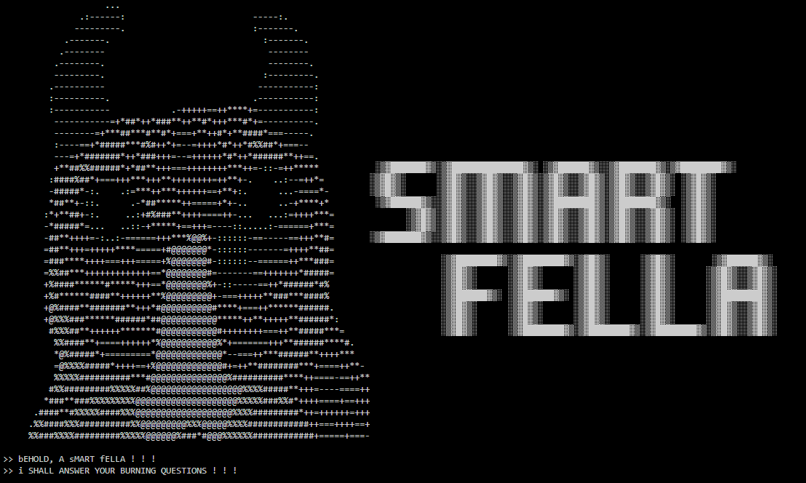
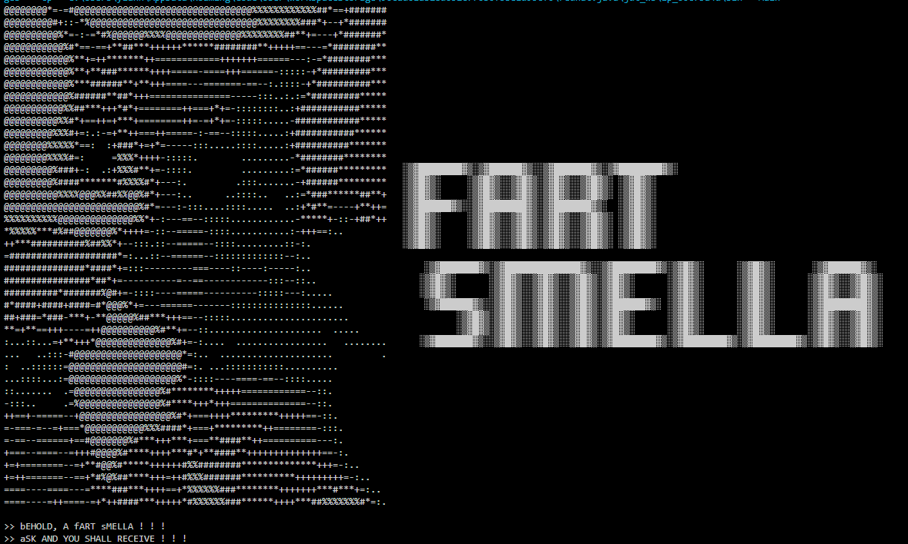

# Smart Fella User Guide

Smart Fella is a command-line task manager with two possible personalities. When the
application starts, it may introduce either a Smart Fella or a Fart Smella.

## Current features

When you meet a Smart Fella, you can add tasks, view them, and update their completion
status. Tasks are shown with a type letter and a completion marker: `[T]`, `[D]`, or
`[E]` for todo, deadline, and event tasks respectively; `[X]` means completed.

| Command | Description | Example |
| --- | --- | --- |
| `todo DESCRIPTION` | Adds a todo task. | `todo finish tutorial` |
| `deadline DESCRIPTION /by DATE` | Adds a task with a deadline. | `deadline submit assignment /by Friday` |
| `event DESCRIPTION /from START /to END` | Adds an event with a start and end. | `event team meeting /from 2pm /to 3pm` |
| `list` | Displays all saved tasks. | `list` |
| `mark NUMBER` | Marks the numbered task as complete. | `mark 1` |
| `unmark NUMBER` | Marks the numbered task as incomplete. | `unmark 1` |
| `bye` | Exits the application. | `bye` |

## Input validation

The application explains invalid commands in its own distinctive style. It checks for:

- missing task descriptions, deadlines, event times, and task numbers;
- malformed todo, deadline, and event command formats;
- missing or repeated `/by`, `/from`, and `/to` arguments;
- non-numeric and out-of-range task numbers; and
- attempts to mark an already marked task or unmark an already unmarked task.

## Fart Smella

Let's just say that the Fart Smella has a more selective personality.
