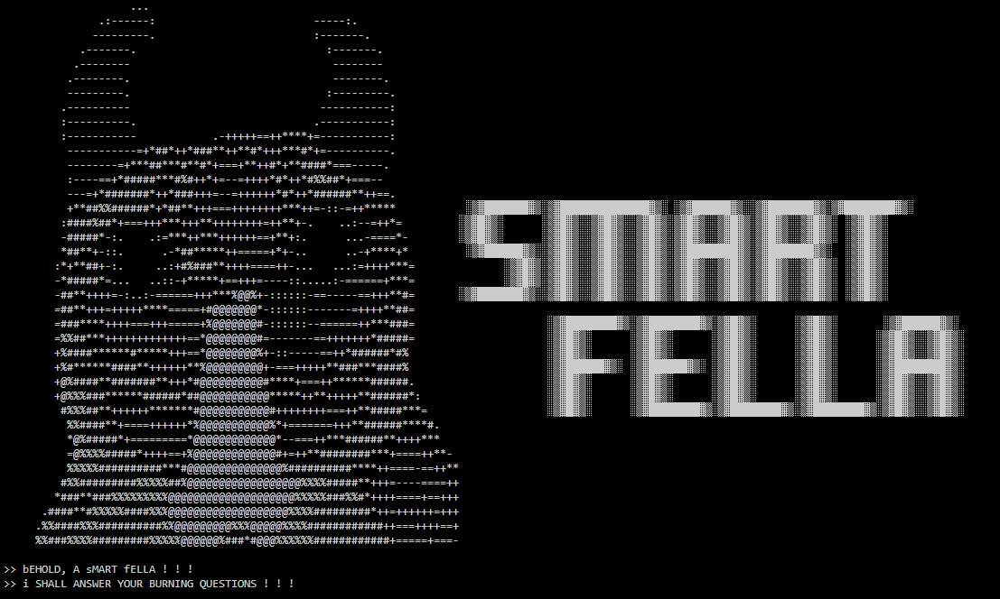
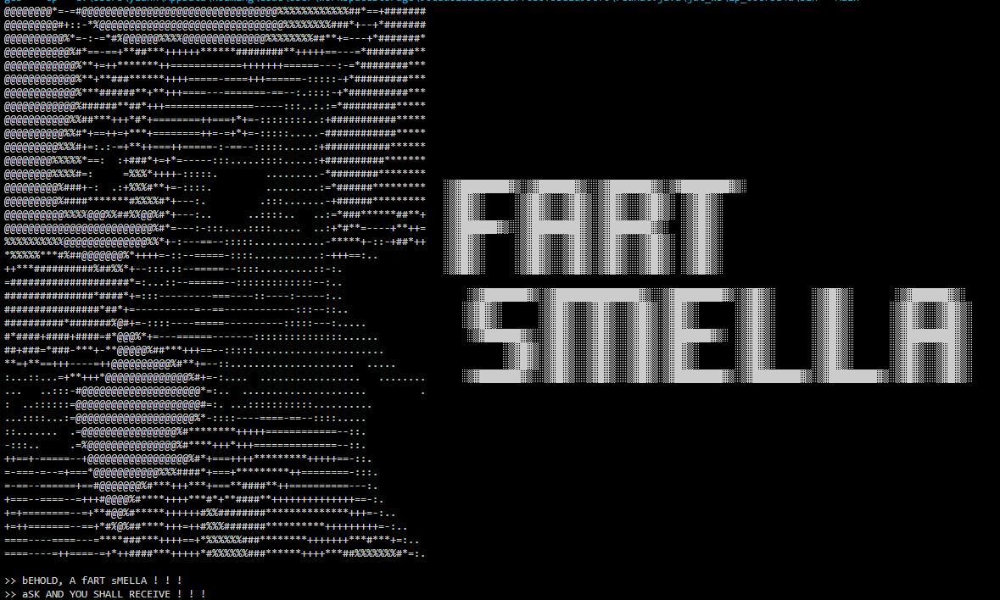

# Smart Fella User Guide

Smart Fella is a command-line task manager with two possible personalities. When the
application starts, it may introduce either a Smart Fella or a Fart Smella.



## Current features

When you meet a Smart Fella, you can add tasks, view them, search their descriptions,
and update their completion status. Tasks are shown with a type letter and a completion
marker: `[T]`, `[D]`, or `[E]` for todo, deadline, and event tasks respectively; `[X]`
means completed.

| Command | Description | Example |
| --- | --- | --- |
| `todo DESCRIPTION` | Adds a todo task. | `todo finish tutorial`<br>`todo buy groceries` |
| `deadline DESCRIPTION /by DATE` | Adds a task with a deadline. Use `DD-MM-YY HHMM`; `YY` and `HHMM` are optional. | `deadline submit assignment /by 03-10-26 1430`<br>`deadline renew pass /by 15-11` |
| `event DESCRIPTION /from START /to END` | Adds an event. Both dates use `DD-MM-YY HHMM`, and the start must be earlier than the end. | `event team meeting /from 04-10-26 0900 /to 04-10-26 1000`<br>`event lunch /from 05-10 1200 /to 05-10 1300` |
| `list` | Displays all saved tasks.  | `list`<br>`list /sort name asc /filter deadline notdone` |
| `list /sort FIELD DIRECTION` | Sorts by `name` or `date` in `asc` or `desc` order. Date sorting places undated todos at the bottom. | `list /sort name asc`<br>`list /sort date desc` |
| `list /filter FILTER...` | Filters by task type (`todo`, `deadline`, `event`) or status (`done`, `notdone`). Multiple filters can be combined. | `list /filter event`<br>`list /filter todo notdone` |
| `find TEXT` | Displays tasks whose descriptions contain `TEXT`, ignoring letter case. | `find book`<br>`find assignment` |
| `mark NUMBER` | Marks the numbered task as complete. | `mark 1`<br>`mark 3` |
| `unmark NUMBER` | Marks the numbered task as incomplete. | `unmark 1`<br>`unmark 3` |
| `delete NUMBER` | Deletes the numbered task. | `delete 1`<br>`delete 3` |
| `bye` | Exits the application. | `bye` |

Sorting and filtering can be combined in either order. For example:

```text
list /sort name desc /filter todo notdone
list /sort date asc /filter deadline done
list /sort date desc /filter deadline todo done
```

## Input validation

The application explains invalid commands in its own distinctive style. It checks for:

- missing task descriptions, deadlines, event times, and task numbers;
- malformed todo, deadline, and event command formats;
- invalid dates, times, and event date ordering;
- missing or repeated `/by`, `/from`, and `/to` arguments;
- invalid list sorting or filtering options;
- empty `find` searches and searches with no matching tasks;
- non-numeric and out-of-range task numbers; and
- attempts to mark an already marked task or unmark an already unmarked task.

## Fart Smella



Let's just say that the Fart Smella has a more selective personality.
